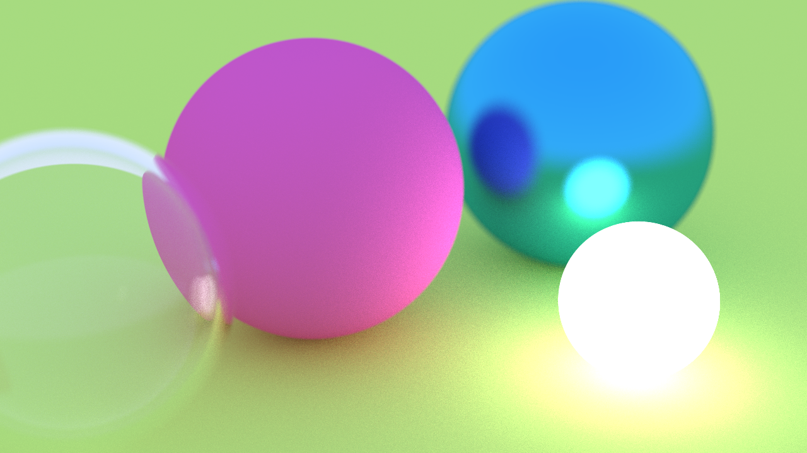
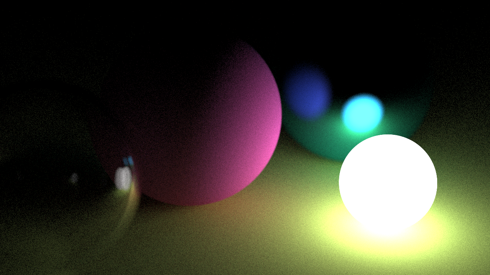

This is a ray tracer renderer, it's based on the book series [_Ray Tracing in One Weekend_](https://raytracing.github.io/books/RayTracingInOneWeekend.html) by Peter Shirley.

It generates a .ppm image, settings configurable on the main.cc file.

## Usage

To generate an image use the comand (On UNIX systems):
```
    ./main > image.ppm
```

## Result



